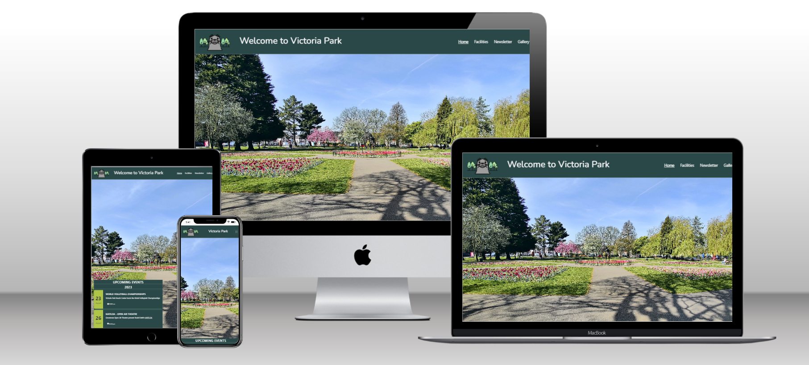
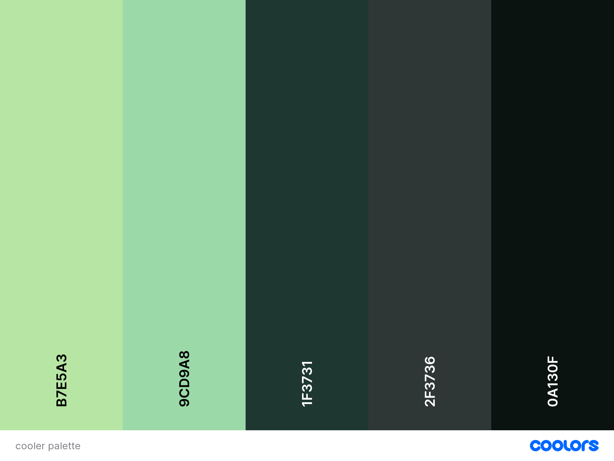

# **Victoria Park Community**

[View the live project here](https://lisaloudness.github.io/milestone_project_1/)

## **Table Of Content**
1. [Introduction](#introduction)
2. [Development](#development)
3. [UX](#ux)
   - [User Demographic](#user-demographic)
   - [User Stories](#user-stories)
     - [Current User Goals](#current-user-goals)
     - [New User Goals](#new-user-goals)
     - [Future User Goals](#future-user-goals)
4. [Website Design](#website-design)
5. [Typography](#typography)
6. [Color Scheme](#color-scheme)
7. [Features](#features)
8. [Testing](#testing)  
9. [Technologies Used](#technologies-used)
10. [Wireframes](#wireframes)

## **Introduction**

Welcome to Victoria Park website. This website has been developed to provide a comprehensive guide to amenities and events in a public park located in the west of Cardiff. Main aim of this website is to provide a comprehensive landing site for events and information regarding Victoria Park. Included will be general information about the park such as amenities, opening times, location and also timestamped events which will require a calendar.

[Back to top](#victoria-park-community)

## **Development**

Victoria Park is a popular park with high footfall. To represent user stories for multiple end users informal discussions were held with:

- dog walker at the park
- ice cream van owner
- 12 year old boy

[Back to top](#victoria-park-community)

## **UX**

### User Demographic

Current users will be residents who live in the vicinity of the park.

Current users will be business owners operating in the park.

New users will be visitors to the park.

New users will be potential business users to the park.

Future users will be people researching the area for living and business use.

### User-Stories

#### Current User Goals

1. As a current user, I want to see what events are on in the park, so I can know what's going on.
2. As a current user, I want to easily view partner websites, so I can access their information easily.
3. As a current user, I want to easily navigate to content I've previously viewed, so I don't have to use multiple mouse clicks.

#### New User Goals

1. As a new user, I want to easily navigate the entire site intuitively so I can easily find the information required.
2. As a new user, I want the information I seek to be easily accessible and relevant so I know that the information is current.
3. As a new user, I want attractive and relavant visuals which work with the content so the content is intuitive.

#### Future User Goals

1. As a future user, I want to see attractive and relavant visuals
2. As a future user, I want to be informed and educated so I get the information I'm browing for.
3. As a future user, I want connect with the community so I feel as if I'm reaching out to a person.

[Back to top](#victoria-park-community)

## **Website Design**

The website will consist of four pages:

### **Home Page**

#### _Key Features_

Landing page will have a background image below the website Title and Nav bar.

Opening times.

Social media links.

Brief summary about the park.

Google map.

### **Facilities Page**

#### _Key Features_

Splash Pad overview and opening times

Web links to partner businesses operating in the park:
Mamas Place

Cardiff Beach Centre

Bloc

Cylch Meithrin Y Parc

### **Newsletter Page**

#### _Key Features_

Contact form to include name, email, reason for enquiry, radio buttons for newsletter.

### **Gallery Page**
#### _Key Features_

[Back to top](#victoria-park-community)

## Typography

[Google Fonts](https://fonts.google.com/)

## Color scheme

Using the [COOLERS](https://coolors.co/image-picker) colour palette generator, the colour scheme chosen is based on the logo.

## Features

### Nav Bar

Nav Bar is a Bootstrap responsive container which collapses to hamburger style drop-down menu.

### Footer

Footer to include:
Copyright
Live weblinks to social media accounts partnered with social branding icon.

[Back to top](#victoria-park-community)

## **Testing**

All testing performed for Milestone Project 1 can be found here:
[View Test Document here](/TESTING.md)

## **Technologies Used**

### **Main Languages Used**

- [HTML5](https://en.wikipedia.org/wiki/HTML5)

- [CSS3](https://en.wikipedia.org/wiki/Code_Composer_Studio "Link to CSS Wiki")

### **Additional Languages Used**

- [JavaScript] (https://en.wikipedia.org/wiki/JavaScript "Link to JavaScipt Wiki)
  - Used to implement the close/collapse feature in the hamburger menu

### **Frameworks, Libraries & Programs Used**

- [Bootstrap 5.3] (https://getbootstrap.com/ "Link to Bootsrap homepage")
  -Boostrap was used to assist with responsiveness and style of website
- [Google Fonts](https://fonts.google.com/ "Link to Google Fonts")
  - Google fonts was used to import the fonts "Nunito"and "Roboto"into the style.css file. These fonts were used throughout the project.
- [Font Awesome](https://fontawesome.com/ "Link to FontAwesome")
  - Font Awesome was used to import icons (e.g. social media icons) for UX purposes.
- [Code Anywhere](https://www.codeanywhere.com/ "Link to Code Anywhere homepage")
  - Code Anywhere was used for writing code, commiting, and then pushing to GitHub.
- [GitHub](https://github.com/ "Link to GitHub")
  - GitHub was used to store the project after pushing
- [Balsamiq](https://balsamiq.com/ "Link to Balsamiq homepage")
  - Balsamiq was used to create the wireframes during the design process.
- [Microsoft Paint](https://en.wikipedia.org/wiki/Microsoft_Paint "Link to Wikipedia Microsoft Paint")
  - Microsoft Paint was used for resizing images and editing photos for the website.
- [Am I Responsive?](http://ami.responsivedesign.is/# "Link to Am I Responsive Homepage")
  - Am I Responsive was used in order to see responsive design throughout the process and to generate mockup imagery to be used. 
- [FREE FORMATTER](https://www.freeformatter.com/ "Link to Free Formatter home page")
  - Free Formatter was used to format all html script.

[Back to top](#victoria-park-community)  

## Wireframes

#### \Home Page

#### \Facilities page.

[Back to top](#victoria-park-community)