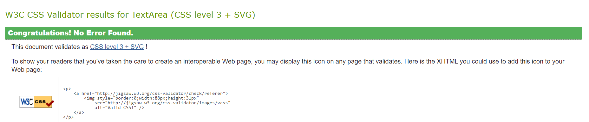

# Victoria Park - Testing

[Main README.md file](/README.md)

[View live project](https://lisaloudness.github.io/milestone_project_1/)

[View Github repository](https://github.com/lisaloudness/milestone_project_1)

---

## Table of Contents

1. [Testing User Stories](#Testing-User_Stories)
2. [Manual Testing](#Manual-Testing)
3. [Automated Testing](#Automated-Testing)
   - [Code Validation](#Code-Validation)
   - [Browser Validation](#Browser-Validation)
4. [User Testing](User-Testing)

## **Testing User Stories**

1. As a current user, I want to see what events are on in the park, so I can know what's going on.
   - The Events calendar is easily scrollable on the homepage, providing comprehensive information about specific events.
   -
2. As a current user, I want to easily view partner websites, so I can access their information easily.
   - A dedicated section on the Facilities page is dedicated to partner businesses. From here users can easily navigate to third party websites.
   - Social Media links are easily accessible in the footer on each page.
   -
3. As a current user, I want to easily navigate to content I've previously viewed, so I don't have to use multiple mouse clicks.

   - The nav bar is prominentely displayed in the header on all pages and all pages can be easily navigated from here.
   - The responsive element of the navbar collapses to a hamburger menu which has a dropdown menu on small and medium screens.
   - The logo which is in a prominent position at the top of all pages, navigates to the home page.

4. As a new user, I want to easily navigate the entire site intuitively so I can easily find the information required.

   - The website pages are clearly labelled and descriptive of the content.
   - Social Media links are easily accessible in the footer on each page.

5. As a new user, I want the information I seek to be easily accessible and relevant so I know that information is current when I visit the park.

   - The Events calendar is time stamped displaying upcoming 4 events. The Events calendar will be updated regularly by website administrator.
   - Opening times and closing times will be reviewed on an annual basis

6. As a new user, I want attractive and relavant visuals which work with the content so the content is intuitive.

   - Images of Victoria Park have been used throughout the website, drawing the user in to the beauty of the park.
   - Parallax effect has been used to maximise the viewport of the background images depending on the user's device.

7. ## As a future user, I want to see attractive and relevant visuals.
   -
   - An embedded Google Maps which invites the user to click into an interactive map for directions.
8. ## As a future user, I want to be informed and educated so I know what to expect when visiting the park.
   -
9. As a future user, I want connect with the community so I feel as if I'm reaching out to a person.
   - [Back to top](#Victoria-park---testing)

## **Manual Testing**

1. Developer Tools were used throughout the developement process to test website responsiveness on all devices.

2. All links within the site were tested to ensure that

   - all navigation links are working.
   - social media links and third party partner links are working and open in a new page.
   - Hover states work correctly.

3. The form element on the Newsletter tab was tested to ensure that:
   - The ''Required'' fields are working.
   - The submit button opens the code institute form dump page in a new tab.
   - The radio button is set to default.

## **W3 Validation**

The W3C Markup Validator and W3C CSS Validator Services were used to validate the website to ensure there were no syntax errors in the html and css code.  
[W3C Markup Validator](https://validator.w3.org) - There were no error detected.


[W3C CSS Validator](https://jigsaw.w3.org/css-validator/) - There were no error detected.


## **Light House Testing**

The Chrome Light House testing was used to to audit the performance, accessibility, best practices, and SEO. After applying some changes to make the performance faster, including converting all images to webp format, setting a width and height to some images, adding a ```rel=noopener``` to social media links, here are the results:

1. Index page
   -[Desktop Home Page Results](assets/testing/home_desktop_lh.png "Light House Desktop Results")
      -[Full report can be found here](assets/testing/home_desktop.com-2023)
   -[Mobile Home Page Results](assets/testing/home_mobile_lh.png "Light House mobile results")
      -[Full report can be found here](assets/testing/home_mobile.com-2023)
2. Facilities page
    -[Desktop Facilities Page Results](assets/testing/facilities_desktop_lh.png "Light House Desktop Results")
      -[Full report can be found here](assets/testing/facilities_desktop.com-2023)
    -[Mobile Facilities Page Results](assets/testing/facilities_mobile_lh.png "Light House mobile results")
      -[Full report can be found here](assets/testing/facilities_mobile.com-2023)

3. Newsletter page
    -[Desktop Newsletter Page Results](assets/testing/contact_desktop_lh.png "Light House Desktop Results")
      -[Full report can be found here](assets/testing/contact_desktop.com-2023)
   -[Mobile Newsletter Page Results](assets/testing/contact_mobile_lh.png "Light House mobile results")
      -[Full report can be found here](assets/testing/contact_mobile.com-2023)

4. Gallery page
    -[Desktop Gallery Page Results](assets/testing/gallery_desktop_lh.png "Light House Desktop Results")
      -[Full report can be found here](assets/testing/gallery_desktop.com-2023)
   -[Mobile Gallery Page Results](assets/testing/gallery_mobile_lh.png "Light House mobile results")
      -[Full report can be found here](assets/testing/gallery_mobile.com-2023)


