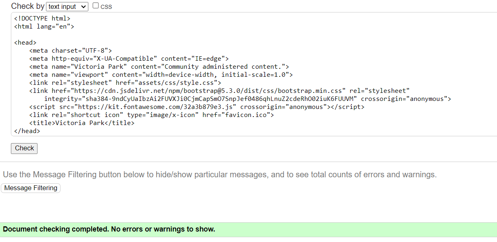

# Victoria Park - Testing

[Main README.md file](/README.md)

[View live project](https://lisaloudness.github.io/milestone_project_1/)

[View Github repository](https://github.com/lisaloudness/milestone_project_1)

</br>

## Table of Contents

1. [Testing User Stories](#Testing-User_Stories)
2. [Manual Testing](#Manual-Testing)
3. [Automated Testing](#Automated-Testing)
   - [Code Validation](#Code-Validation)
   - [Browser Validation](#Browser-Validation)
4. [User Testing](User-Testing)

</br>

## **Testing User Stories**

1. As a current user, I want to see what events are on in the park, so I can know what's going on.
   - The Events calendar is easily scrollable on the homepage, providing comprehensive information about specific events.
   - Social Media links are easily accessible in the footer on all pages.

2. As a current user, I want to easily view partner websites, so I can access their information easily.
   - The second section on the Facilities page is dedicated to partner businesses. From here users can easily navigate to third party websites. These are easily identified as hyperlinks due to the curser style changing when hovering on the links and they are underlined.
   - Social Media links are easily accessible in the footer on each page.
   
3. As a current user, I want to easily navigate to content I've previously viewed, so I don't have to use multiple mouse clicks.

   - The navigation bar is clearly defined and prominently displayed in the header on all pages and easy for users to find and navigate.
   - The responsive element of the navbar collapses to a hamburger menu which has a dropdown menu on small and medium screens. This is also clearly defined and easy for users to find and use.
   - The logo which is in a prominent position at the top of all pages, always navigates to the home page.

4. As a new user, I want to easily navigate the entire site intuitively so I can easily find the information required.

   - The website pages are clearly labelled and descriptive of the content.
   - Social Media links are easily accessible in the footer on each page.

5. As a new user, I want the information I seek to be easily accessible and relevant so I know that information is current when I visit the park.

   - The Events calendar is time stamped displaying upcoming 4 events. The Events calendar will be updated regularly by website administrator.
   - Opening times and closing times will be reviewed on an annual basis

6. As a new user, I want attractive and relevant visuals which work with the content so the content is intuitive.
   - Images of Victoria Park have been used throughout the website, drawing the user in to the beauty of the park.
   - Parallax effect has been used to maximise the viewport of the background images depending on the user's device.
   - An attractive color palette was created using the logo and background images as color generators.

7. As a future user, I want to see attractive and relevant visuals.
   - The website includes many current photos of the park. Parallax effects used on background images keep the users eye on colorful visuals.
   - An embedded Google Maps API on the homepage invites the user to click into an interactive map for directions.
   - The Gallery page provides colourful and stimulating visuals of many aspects of Victoria Park.

8. As a future user, I want to be informed and educated so I know what to expect when visiting the park.
   - The website is full of colorful and appealing images of the park giving a sound overview to the user of what the park looks like.
   - The Faciliies page showcases the main attraction of the park which is the Splash Pad. Also  

9. As a future user, I want connect with the community so I feel as if I'm reaching out to a person.
   - Social Media platforms are accessible from the footer on all pages.  These provide realtime interaction for the user.
   - The Newsletter page invites the user to subscribe to a Newsletter which will mostly be an email highlighting the upcoming events on the home page.
   - The form gives the user opportunity to leave comments or ask questions to Friends of Victoria Park.

[Back to top](#Victoria-park---testing)

</br>   

## **Manual Testing**

1. Developer Tools were used throughout the development process to test website responsiveness on all devices.

2. All links within the site were tested to ensure that:

   - All navigation links are working.
   - Social media links and third party partner links are working and open in a new page.
   - Hover states work correctly.

3. The form element on the Newsletter tab was tested to ensure that:
   - The ''Required'' fields are working.
   - The submit button opens the code institute form dump page in a new tab.
   - The radio button is set to default.

[Back to top](#Victoria-park---testing)
</br>

## **Automated Testing**

## **Code Validation**

The W3C Markup Validator and W3C CSS Validator Services were used to validate the website to ensure there were no syntax errors in the html and css code.  
[W3C Markup Validator](https://validator.w3.org) - There were no error detected.


[W3C CSS Validator](https://jigsaw.w3.org/css-validator/) - There were no error detected.


## **Browser Validation**

The Chrome Light House testing was used to audit the performance, accessibility, best practices, and SEO. After applying some changes to make the performance faster, including converting all images to webp format, setting a width and height to some images, adding a ```rel=noopener``` to social media links, here are the results:

1. Index page
   - Desktop [Full report can be found here](assets/testing/home_desktop.com-2023)
   - 

   - Mobile [Full report can be found here](assets/testing/home_mobile.com-2023)
   - 


2. Facilities page
   - Desktop [Full report can be found here](assets/testing/facilities_desktop.com-2023)
   - 

   - Mobile [Full report can be found here](assets/testing/facilities_mobile.com-2023)
   - 


3. Newsletter page
   - Desktop [Full report can be found here](assets/testing/contact_desktop.com-2023)
   - 

   - Mobile [Full report can be found here](assets/testing/contact_mobile.com-2023)
   - 


4. Gallery page
   - Desktop [Full report can be found here](assets/testing/gallery_desktop.com-2023)
   - 

   - Mobile [Full report can be found here](assets/testing/gallery_mobile.com-2023)
   - 


[Back to top](#Victoria-park---testing)
</br>


## **User Testing**

The website was shared with family and colleagues for their valued feedback. Common issues noted in the feedback were fixed
- The social media icons for Instagram and Twitter were in the wrong place.
- Twitter is now re=branded as X.
- The background photos appear zoomed on IOS devices.  This is a known bug of background-attachment-fixed style on IOS.
- The original background color chosen from the color palette was changed from #9CD9A8 to a stronger #62760c to compliment the font color and stronger contrast.


